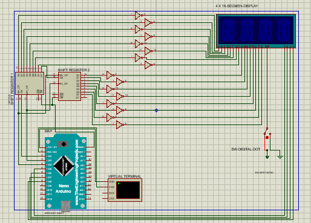
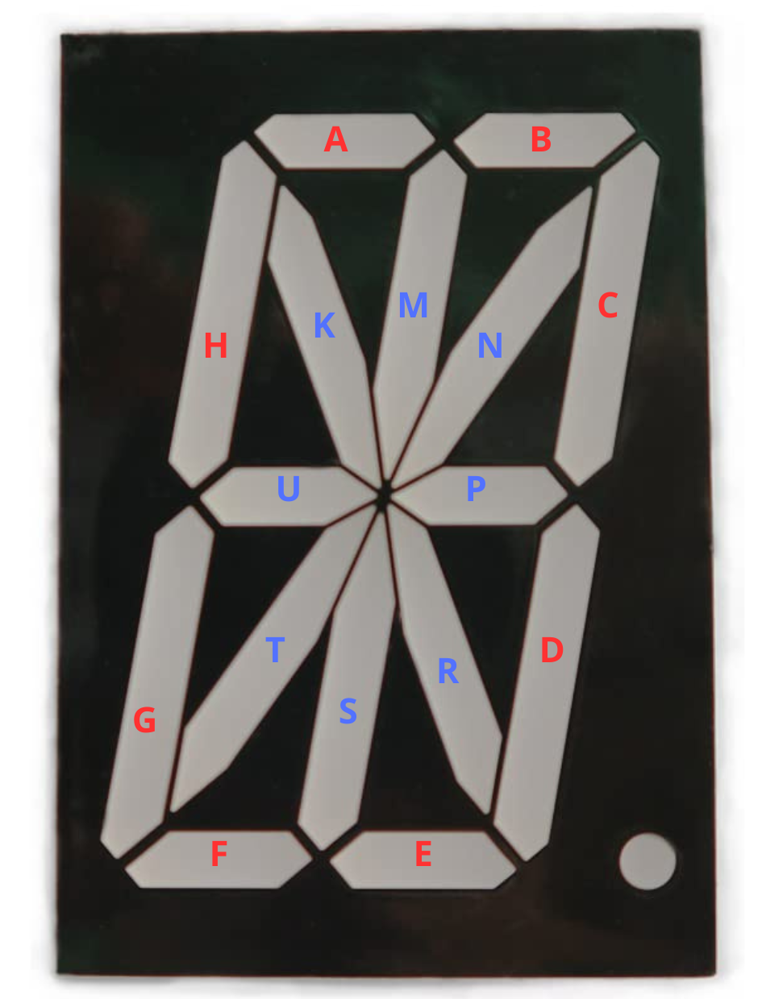

# CharacterDisplay

Menampilkan angka dan karakter pada tampilan 16-segment menggunakan Arduino. Proyek ini memanfaatkan teknik multiplexing dan penghitungan karakter untuk memberikan tampilan yang halus dan responsif. Dengan kemampuan untuk menampilkan kombinasi karakter yang ditentukan.

